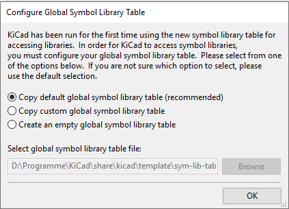
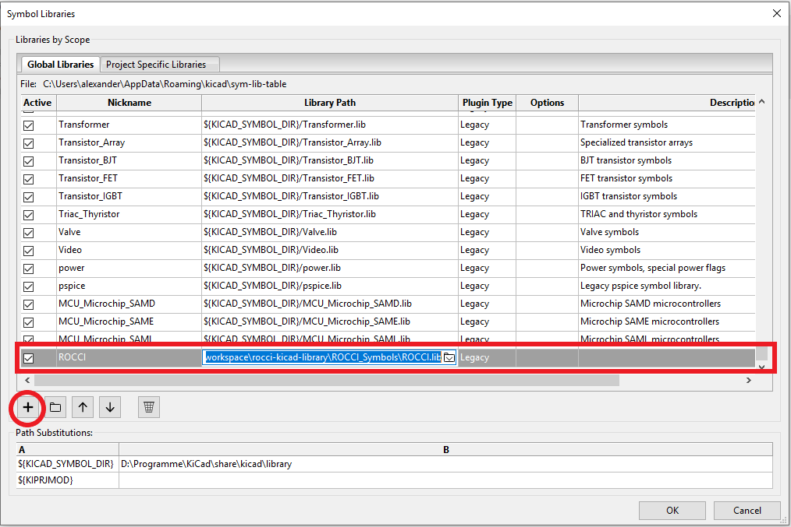
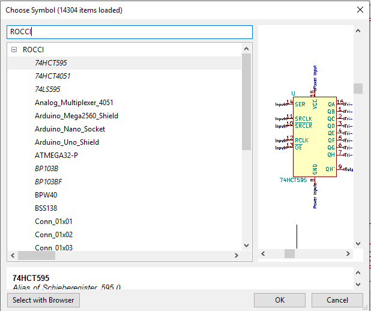
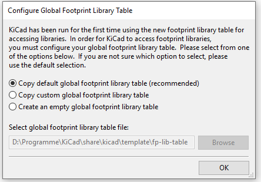
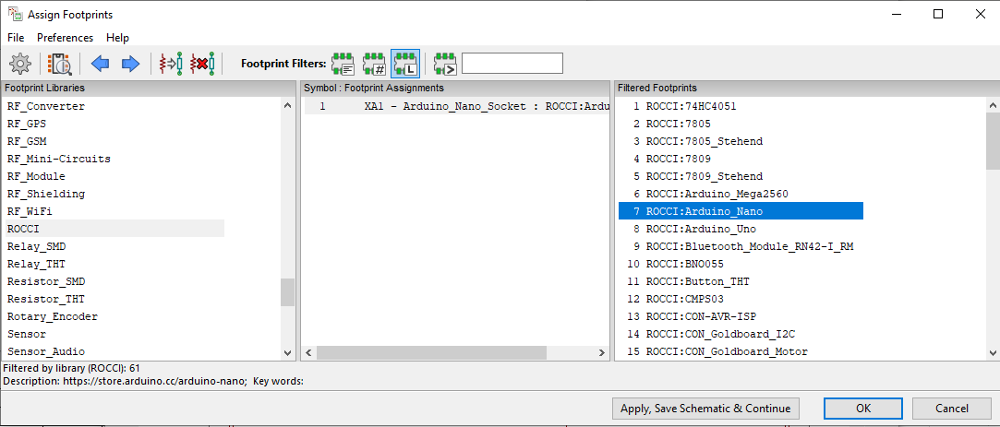

# rocci-kicad-library 

Diese Bibliothek enthält alle im RoCCI verwendeten Bauteile. Sie ist für Kicad Version 5.1 gedacht.

## Einbinden

### Symbole

Wenn KiCAD zum ersten mal gestartet wird, erhaltet ihr beim öffnen der Bauteilbibliotheks-Verwaltung folgendes Menü:

Nach bestätigen wird die Bauteilbibliotheks-Verwaltung geöffnet und ihr könnt einen Verweis auf die ROCCI.lib erstellen:

Beim Einfügen neuer Bauteile in den Schaltplan ist die ROCCI lib dann verfügbar:

### Footprints

Wenn KiCAD zum ersten mal gestartet wird, erhaltet ihr beim öffnen der Footprint-Verwaltung folgendes Menü:

Nach bestätigen wird die Footprint-Verwaltung geöffnet und ihr könnt einen Verweis auf den Ornder ROCCI_footprint.pretty erstellen:

Beim verknüpfen der Symbole mit den Footprints steht dann die ROCCI lib zur verfügung:

## KiCAD-Doku

> http://docs.kicad-pcb.org/5.1.2/de/getting_started_in_kicad/getting_started_in_kicad.html
